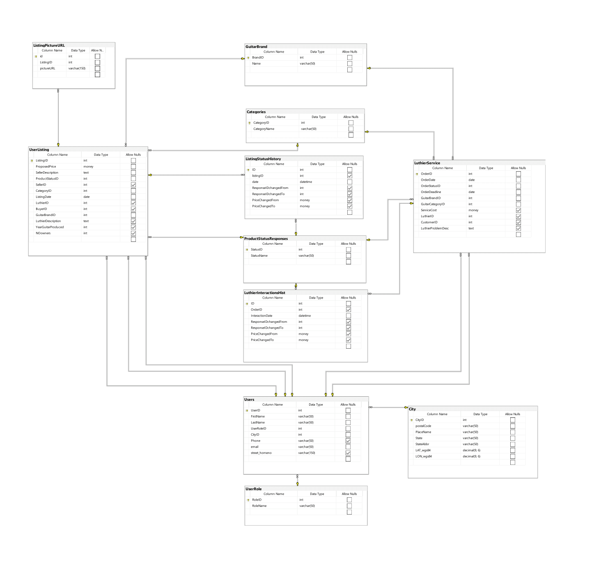

# e_komis_agh

LuthierWeb project

SQL Server db + Django

Pełna wersja pracy w pliku Finalna_Bartosz_Kawa.pdf

Celem projektu było stworzenie bazy danych i elementów aplikacji bazodanowej obsługujacych komis sprzętu gitarowego i zakład usług lutniczych.

W celu stworzenia aplikacji bazodanowej wykorzystany został język programowania Python i framework webowy Django w wersji 3.0. Z użyciem biblioteki django-mssql-backend baza danych, stworzona w Microsoft SQL Server, została połączona z aplikacją. Do zaimplementowania części front-end aplikacji użyty został framework Materialize.
Zaimplementowane zostały fragmenty aplikacji umożliwiające przeglądanie ofert komisu, wyświetlanie szczegółów konkretnego ogłoszenia, możliwość "zakupienia produktu" i formularz dzięki któremu użytkownik dodać może nowe ogłoszenie.

Informacje o wystawianym na sprzedaż przedmiocie przekazane przez użytkownika w formularzu zostają zapisane w bazie danych, a zdjęcia zapisywane zostają na serwerze (w bazie danych zapisana zostaje wyłącznie nazwa zdjęcia). Użytkownik przeglądać może ogłoszenia znajdujące się w bazie danych, a po kliknięciu na wybrane ogłoszenie, przejść do jego szczegółów. W tym miejscu użytkownik może kupić sprzęt naciskając na przycisk ‘Buy!’, który wywołuje procedurę składowaną spChangeListingProductStatus, zmieniającą status przedmiotu, co skutkuje wyłączeniem przedmiotu z listy ogłoszeń.
Dodatkowo, framework Django udostępnia funkcjonalność panelu administracyjnego, gdzie po zalogowaniu się jako administrator, możliwe są operacje dodawania, usuwania i modyfikacji ogłoszeń.

Screenshots:
database schema:

app screens:

