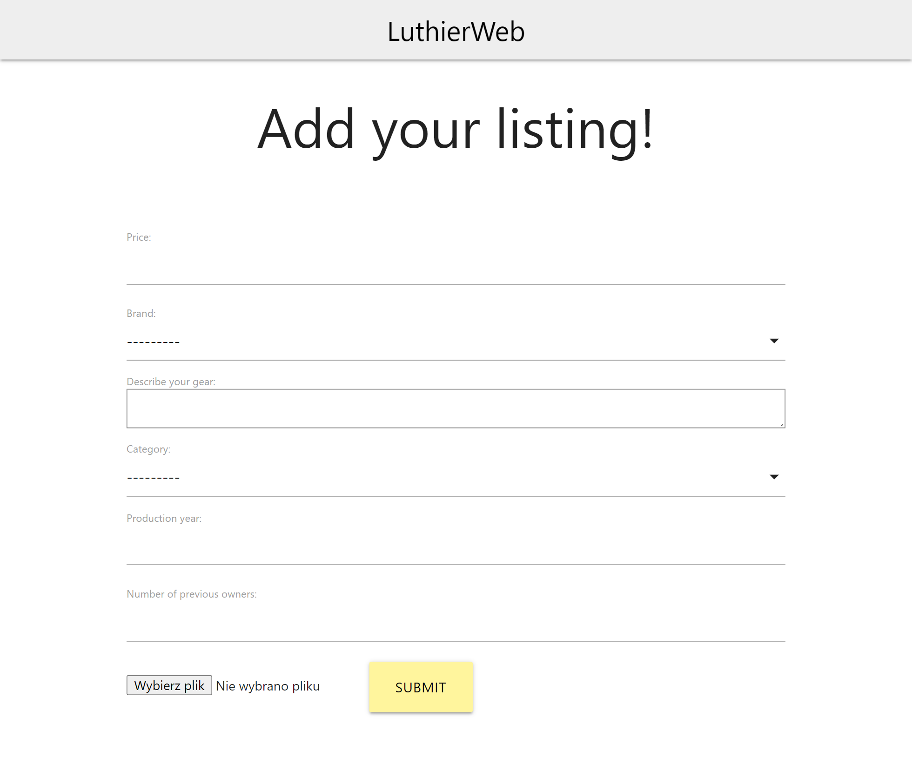
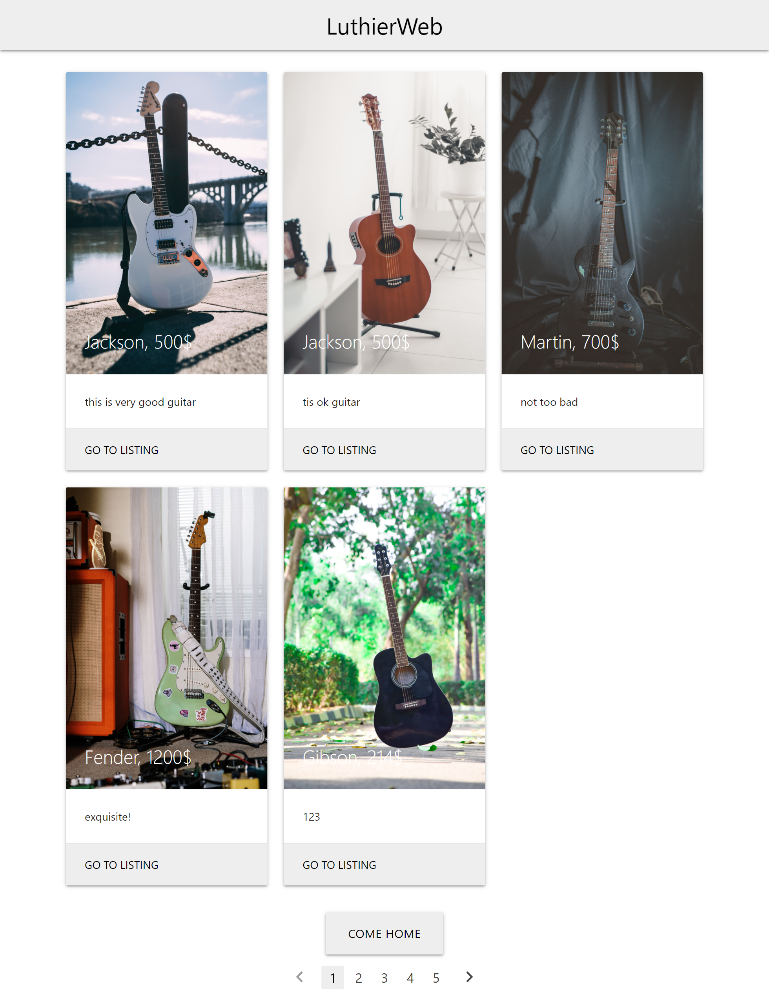

# e_komis_agh

LuthierWeb project

Celem niniejeszej pracy było stworzenie bazy danych i elementów aplikacji bazodanowej obsługujacych komis sprzętu gitarowego i zakład usług lutniczych. Cele biznesowe związane z funkcjonowaniem systemu zoperacjonalizowane zostały w terminach wymagań funkcjonalnych i przypadków użycia, co umożliwiło ich późniejsze wdrożenie. Wykonane zostały fragmenty interfejsu użytkownika stanowiące podstawę dla implementacji aplikacji. Stworzona została baza danych odpowiadająca przedstawionym wymogom funkcjonalnym i organizująca dane związane z systemem w sposób przejrzysty. Funkcjonowanie bazy danych usprawione zostało poprzez implementację widoków, procedur i triggerów. Ostatnim etapem projektu było wykonanie elementów aplikacji bazodanowej. Zaimplementowane zostały elementy aplikacji webowej umożliwiające umieszczanie nowych ogłoszeń, wyświetlanie ich, możliwość zakupu przedmiotów i zarządzania ogłoszeniami, a więc podstawowe funkcjonalności związane z działaniem systemu.

W celu stworzenia aplikacji bazodanowej wykorzystany został język programowania Python i framework webowy Django w wersji 3.0. Z użyciem biblioteki django-mssql-backend baza danych, stworzona w Microsoft SQL Server, została połączona z aplikacją. Do zaimplementowania części front-end aplikacji użyty został framework Materialize.
Zaimplementowane zostały fragmenty aplikacji umożliwiające przeglądanie ofert komisu, wyświetlanie szczegółów konkretnego ogłoszenia, i formularz dzięki któremu użytkownik dodać może nowe ogłoszenie.

Screenshots:

